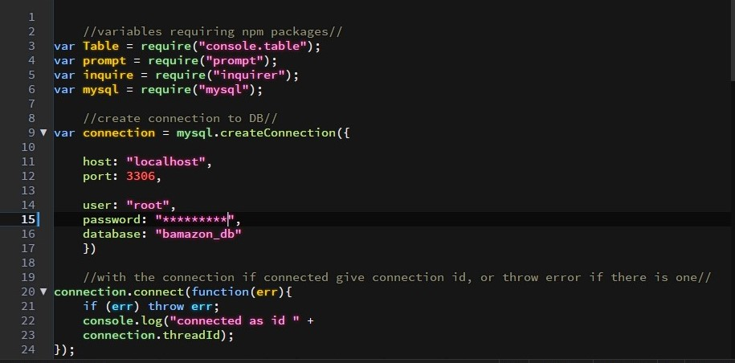
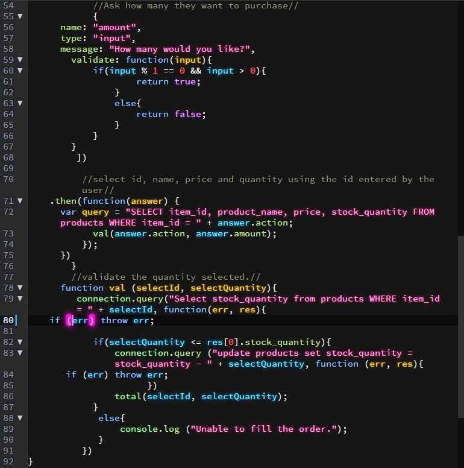

# Bamazon
This is designed to be a storefront for purchasing items.

The application will first show the items available with the price for each to the customer.

Once the customer decides what the want to purchase they are asked how many of each.  The database will be called to validate to total number of items requested vs the total available.
If there are enough of that item it will allow a purchase if not it will tell the customer there is not enough in stock.

Once the purchase is made the database will be updated with the item(s) removed from the stock and the customer can purchase other items.

To get the customers to be able to purchase we must first create a MySQL Database using the file bamazon_db.sql.

Then create a bamazonCustomer.js file for the customer code and connect it to the DB and show the connected id along with the products.

Show the Customer the products and asks them to select the ID.  If there is no id with that number it will ask them to select a correct item_id

Ask the user how many they want. If they choose the number higher than the remaining stock throw an error.

The full screen showing selections and price.

